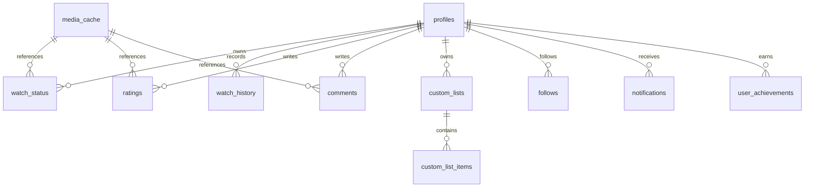

# مخطط قاعدة البيانات

المخطط الكامل موجود في `supabase/migrations/0001_initial_schema.sql`.

كل جدول مستخدم يربط `auth.users(id)`، وسياسات RLS تمنع القراءة أو التعديل خارج نطاق الصلاحية. سيضاف اختبار RLS عند تفعيل بيئة Supabase.
